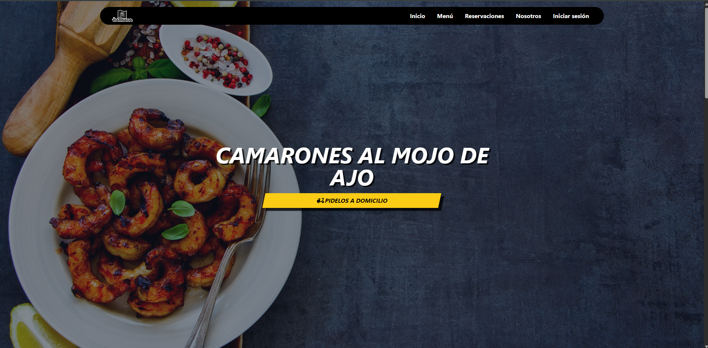
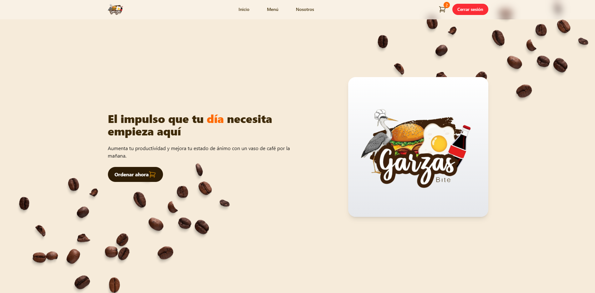

 <h1 align="center"><b>🚀 ¡Hola, soy Irving Emmanuel! </b></h1>

  💻 Ingeniero en Desarrollo y Gestión de Software con enfoque en <strong>desarrollo Full Stack</strong>. 
  🚀 Experiencia práctica en React, 
  Next.js, 
  Node.js y bases de datos SQL/NoSQL. 
  🔧 Apasionado por el código limpio, arquitectura modular y buenas prácticas. 

---

# 🛠️ Tecnologías y Herramientas

<!-- ===== FRONTEND ===== -->

  
  <h4 style="font-size: 24px; font-weight: bold; color: #FF6347;">Frontend Development</h4>

  
  
  
  
  
  
  

 

<!-- ===== BACKEND ===== -->

  
  <h4 style="font-size: 24px; font-weight: bold; color: #FF6347;">Backend Development</h4>

  
  
  
  
  
  

 

<!-- ===== DATABASES ===== -->

  
  <h4 style="font-size: 24px; font-weight: bold; color: #FF6347;">Bases de Datos</h4>

  
  
  
  

 

<!-- ===== MOBILE ===== -->

  
  <h4 style="font-size: 24px; font-weight: bold; color: #FF6347;">Desarrollo Móvil</h4>

  

 

<!-- ===== DEVOPS ===== -->

  
  <h4 style="font-size: 24px; font-weight: bold; color: #4682B4;">DevOps & Cloud</h4>

  
  
  
  
  
  
  
  

 

<!-- ===== TESTING ===== -->

  
  <h4 style="font-size: 24px; font-weight: bold; color: #FF6347;">Testing</h4>

  
  
  

 

---

## 💣 Proyectos  

---

# 🍔 Proyecto 1: **La Barbada – E-Commerce de Comida**

### 📝 Descripción

**La Barbada** es un sistema completo de comida rápida estilo **e-commerce moderno** que permite a los usuarios:

- Ver el menú con productos dinámicos.  
- Crear órdenes y enviarlas directamente al sistema.  
- Autenticarse con **Google, Facebook, Apple o teléfono con OTP** (Auth.js).  
- Pagar con tarjeta atravez de **OpenPay** o confirmar pedidos desde el carro de compra.  

Este proyecto surge como solución real para un negocio local, permitiendo automatizar pedidos y mejorar la atención.

---

### 🖼️ Captura de Pantalla

  

---

### 🛠️ Tecnologías Utilizadas

  
  
  
  
  
  
  

---

# ☕ Proyecto 2: **Garza Bite – Maquetado de E-Commerce Escolar**

### 📝 Descripción

**Garza Bite** es un diseño UI/UX y maquetación avanzada creada para una cafetería escolar.  
Aunque es un prototipo funcional, incluye características típicas de un e-commerce:

- Catálogo de productos con imágenes.  
- Carrito interactivo.  
- UI diseñada para ser limpia, juvenil y moderna.  
- Maquetado responsivo pensado para dispositivos móviles.  

Fue creado como ayuda al equipo de desarrollo de diseño + frontend, aplicando buenas prácticas en componentes y manejo del estado.

---

### 🖼️ Captura de Pantalla

  

---

### 🛠️ Tecnologías Utilizadas

  
  
  
  
  

                                               
